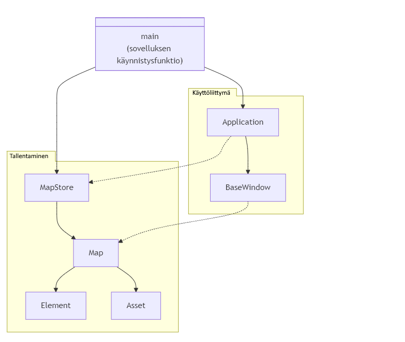
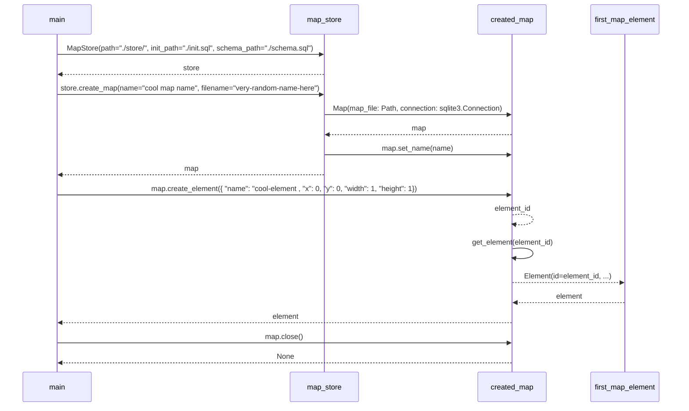

# Arkkitehtuurikuvaus

## Pakkauskaavio

## Sekvenssikaavio: kartan luonti, elementin lisäys ja kartan sulku

```mermaid
sequenceDiagram
    %% Add columns
    participant main
    participant map_store
    participant created_map
    participant first_map_element

    %% Create map
    main->>map_store: MapStore(path="./store/", init_path="./init.sql", schema_path="./schema.sql")
    map_store-->>main: store
    main->>map_store: store.create_map(name="cool map name", filename="very-random-name-here")
    map_store->>created_map: Map(map_file: Path, connection: sqlite3.Connection)
    created_map-->>map_store: map
    map_store->>created_map: map.set_name(name)
    map_store-->>main: map

    %% Add element
    main->>created_map: map.create_element({ "name": "cool-element , "x": 0, "y": 0, "width": 1, "height": 1})
    created_map-->>created_map: element_id
    created_map->>created_map: get_element(element_id)
    created_map-->>first_map_element: Element(id=element_id, ...)
    first_map_element-->>created_map: element
    created_map-->>main: element

    %% Close
    main->>created_map: map.close()
    created_map-->>main: None

```

