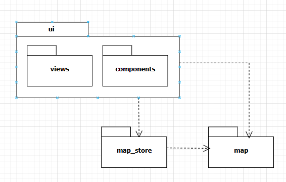
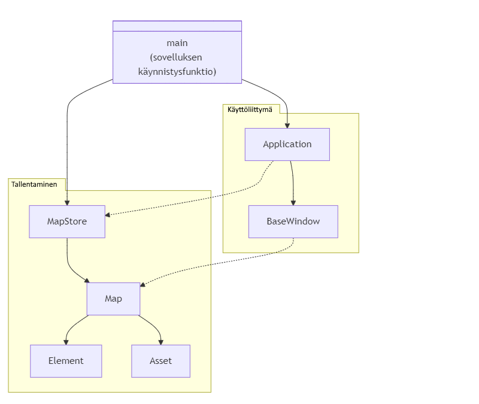
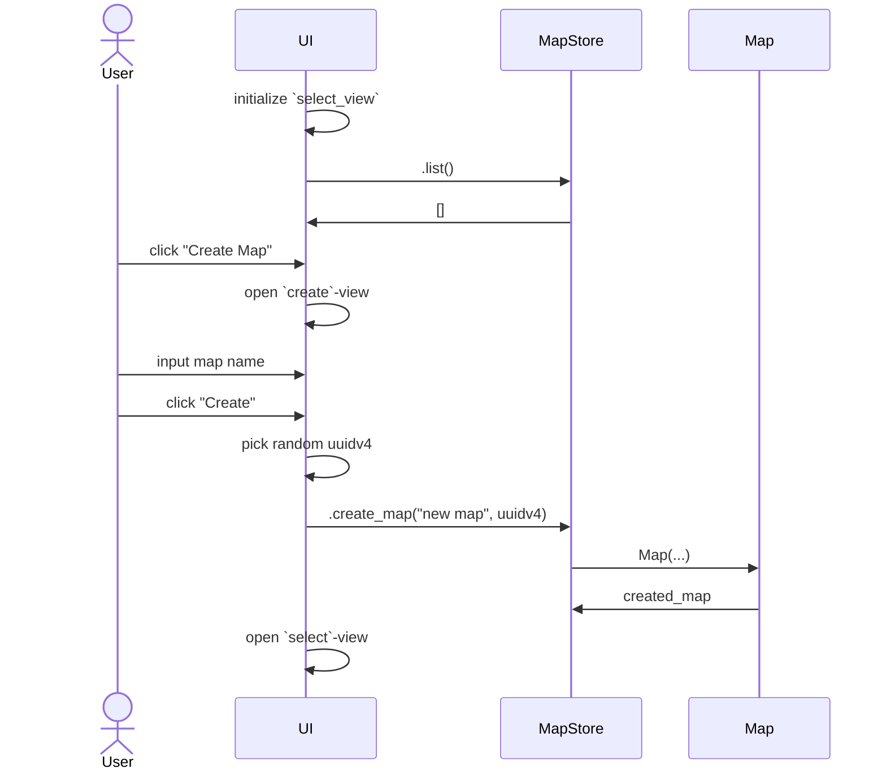
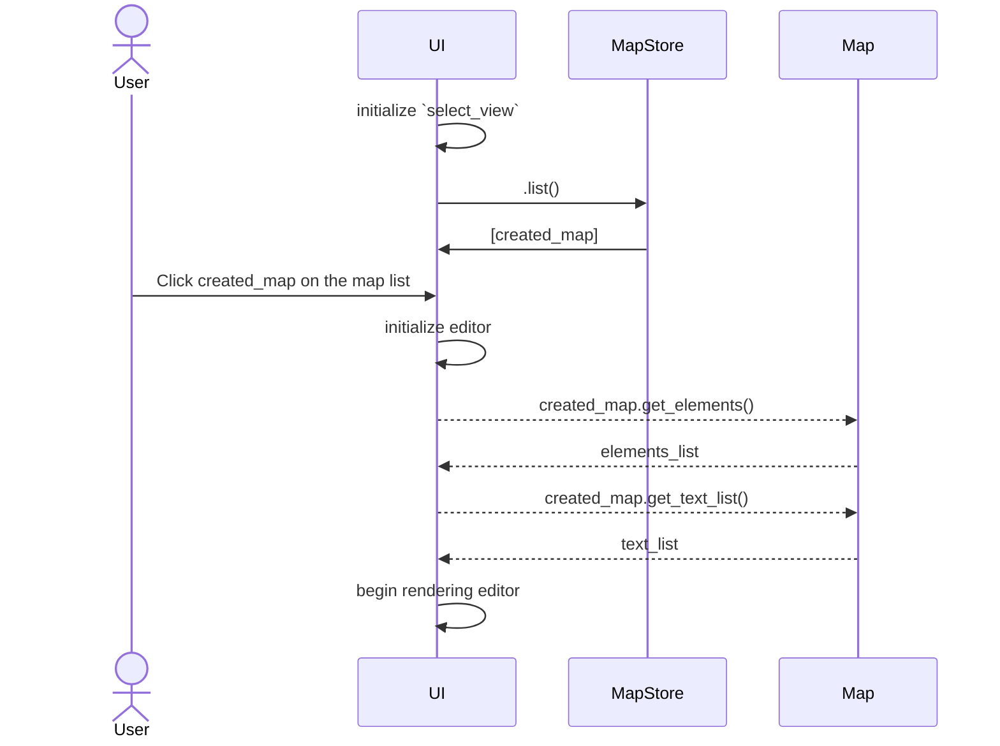
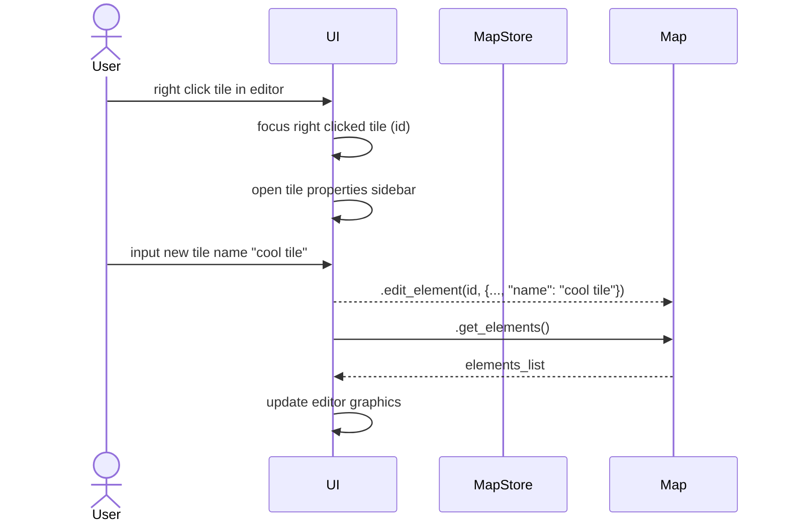
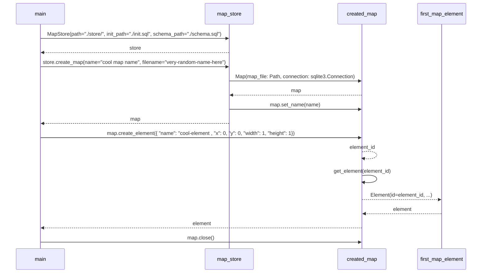

# Arkkitehtuurikuvaus

## Rakenne

Ohjelmassa on kolme keskeistä osaa: `ui`, `map_store` ja `map` -hakemistot.

`ui`-hakemisto sisältää alihakemistot `components` ja `views`.
`views`-hakemisto sisältää sovelluksen näkymät, jotka käyttävät käyttöliittymäkomponentteja `components`-hakemistosta.

`map`-hakemistossa on tiedosto `entity.py`, jonka tehtävän on karttojen käsittely ja muokkaaminen.
`map_store`-hakemistossa on tiedosto `store.py`, jopka hallinnoi karttatiedostoja ja huolehtii niiden pysyväistallentamisesta.

Huom. Tällä hetkellä `map`-hakemiston ohjelmakoodi muokkaa karttatiedostoja suoraan, ei `MapStore`-luokan kautta. Tämä on puute.

## Käyttöliittymä
Käyttöliittymässä on kaksi keskeistä näkymää, sekä muutama lisänäkymä.

**Keskeiset näkymät**
- `select`-näkymä
    - Käyttäjä voi valita, luoda uuden, poistaa tai nimetä uudelleen kartan
    - Käyttäjä voi viedä/tuoda karttoja
- `editor`-näkymä
    - 2D-editori, jossa kartan elementit
    - Käyttäjä voi lisätä objekteja kartalle yläpalkista raahamalla niitä kartalle
    - Klikkaamalla objekteja hiiren oikealla näppäimellä, aukeaa `properties`-sivupaneli objektin muokkaamista varten

**Lisänäkymät**
- `create`-näkymä (luo kartta)
- `rename`-näkymä (uudelleen nimeä kartta)
- `delete`-näkymä (are-you-sure tarkistus ennen kartan poistoa)

Kaikki näkymät on toteutettu omina tiedostoinaan `ui/views` kansioon. Näkymän pohjana on `View`-luokka, jonka näkmät perivät.
Näkymien vaihtamisesta vastaa `Application`-luokka, jonka `change_to_view`-metodi tarjotaan näkymille tarvittaessa.
Näkymät luodaan `BaseWindow`-luokassa omilla metodeillaan, jota `Application`-luokka käyttää (mikäli joskus tarvitaan useampi ikkuna).
Näkymistä voi olla esillä vain yksi kerrallaan.

Käyttöliittymä on erillinen sovelluslogiikasta ja vain kutsuu `MapStore`- tai `Map`-luokkien metodeja.

## Sovelluslogiikka
Sovelluksen loogisen tietomallin keskiössä ovat luokat `MapStore` ja `Map`. Päätoiminnallisuuden tarjoaa `MapStore`-luokan ainoa olio. Luokka tarjoaa kaikille sovelluksen osille metodit `Map`-olioiden muodostamiseen levyllä olevien `.dmap`-tiedostojen pohjalta.

`MapStore`-luokka tarjoaa keskeisiä metodeja, kuten:
- `list()`, joka listaa karttatiedostot ja muodostaa kaikille `Map`-oliot.
- `create_map(name: str, filename: str)`, jonka avulla voi luoda uuden kartan.
- jne.

Tämä pakkauskaavio kuvastaa sovelluksen luokkien hierarkiaa ja suhdetta toisiinsa.

## Tietojen pysyväistallennus
Sovelluksen luokat `Map` ja `MapStore` huolehtivat tietojen pysyväistallennuksesta. `MapStore`-luokka käyttää tiedostojärjestelmää karttatiedostojen löytämiseen ja luontiin. `Map`-luokka vastaa tiedoston sisällön muokkaamisesta, uudelleennimeämisestä ja poistamisesta mikäli tarpeen.

Luokkien valmistelussa on pyritty noudattamaan [Repository](https://en.wikipedia.org/wiki/Data_access_object)-mallia, joten niiden toteutukset voidaan tarvittaessa korvata. Ne tarjoavat korkean tason abstraktion tiedostojärjestelmän käyttöön ja karttojen sisällön muokkaamiseen.

### Karttatiedostot
Karttatiedostot tallennetaan lähtökohtaisesti `./data`-kansioon uniikeilla `uuidv4`-tunnisteilla. Karttojen käyttäjäystävällien nimi, sekä muut tiedot, on tallennettu itse karttaan.

Karttatiedoston rakenne selviää `src/map_store/schemal.sql`-tiedostosta.

**Lyhyesti**
- Tiedostopääte: `.dmap`
- Formaatti: `SQLite`-tietokanta

**Taulut**
- `Text`: teksti-objektit
- `Elements`: kartan elementit
- `Meta`: taulu, jossa vain yksi rivi, jossa kartan metatiedot

## Päätoiminnallisuus
Sovelluksen päätoiminnallisuus on karttatiedostojen muokkaaminen.

**Kartan luominen**

**Kartan valinta ja avaaminen**

**Kartan sisällön muokkaaminen**
Esimerkkinä ruudun nimen muokkaaminen.
Editor näkymä jo auki.

**Muu toiminnallisuus**
Lähtökohtaisesti kaikki muu toiminnallisuus seuraa vastaavaa mallia. Käyttäjä tekee jotain, joka johtaa tapahtuman käsittelyyn käyttöliittymän toimesta, joka kutsuu MapStore ja Map luokkia tapahtuman edellytyksien mukaisesti.

## Sekvenssikaavio: kartan luonti, elementin lisäys ja kartan sulku
Tämä sekvenssikaavio kuvastaa sovelluksen ohjelmallista toimintaa.

## Puutteet
Tällä hetkellä kartan objektien käsittely on koodissa jaettu erikseen Elements ja MapText osiin, joita käsitellään erikseen. Mielekkäämpää olisi käsitellä yhtä suurta MapObject-tyyppiä, joka vähentäisi koodissa toistoa.

Arkkitehtuurillisia poikkeamia on käyttöliittymän MapStore- ja Map-luokkien käsittelyssä. Tavoitteena oli rajata näkymille pääsy vain Map-luokkaan, mutta MapStore on tietyissä tilanteissa tarpeellinen. Käyttöliittymän rakenteen yksinkertaistaminen voisi poistaa nämä edellytykset. Lisäksi kartan poisto tapahtuu Map-luokan kautta, sillä tietokantayhteyden sulkeminen on sen kauttaa mielekkäämpää.
