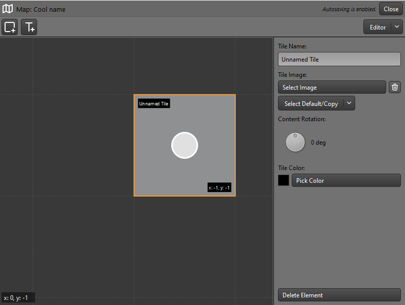

# Käyttöohje
Tämän käyttöohjeen avulla saat sovelluksen käyntiin ja opit sen perustoiminnallisuuksien käytön, kuten kartan luonnin ja sen sisällön muokkaamisen.

### Konfigurointi
Sovellus ei vaadi erillistä konfiguraatiota.

### Sovelluksen käynnistäminen
Ennen sovelluksen käynnistämistä, asenna riippuvuudet:

```bash
poetry install
```

Käynnistä sovellus komennolla:

```bash
poetry run invoke start
```

### Uuden kartan luonti
Ensikäynnistyksen jälkeen sovellus aukeaa `select`-näkymään, joka näyttää seuraavalta:


Kartan luominen onnistuu painamalla `Create Map`-nappia vasemmalla olevan tyhjän listan alapuolella. Kun nappia on painettu, avautuu `create`-näkymä:


Kirjoita kartalle valitsemasi nimi `Enter name`-kenttään ja sen jälkeen paina `Create`-nappia. Tämän jälkeen sovellus palauttaa sinut `select`-näkymään, jossa luotu kartta on nyt vasemmalla listattuna:


Luotu kartta on korostettu kuvaan punaisilla viivoilla.

### Kartan hallintanäppäimet
Jokainen kartta näyttää `select`-näkymän sivupanelin listauksessa seuraavalta:


**Nappien toiminnallisuudet**
-  (1.) Karttaa kuvaavalla merkillä varustettu, isoin nappi, avaa kartan editorissa. Kyseisessä esimerkissä napissa lukee kartan nimi: `Cool name`.
- (2.) Kynän kuvalla varustetulla napilla voit avata `rename`-näkymän kartan uudellennimeämistä varten.
- (3.) Oikealle osoittavalla nuolella varustetulla napilla voit viedä kartan sovelluksesta tiedostoon valitsemaasi sijaintiin. Nappia painamalla avautuu popup jolla voit valita sijainnin.
- (4.) Roska-astian kuvalla varustettu nappi avaa `delete`-näkymän, josta voit poistaa kyseisen kartan.

### Ruudun lisääminen kartalle
Ennen kartan muokaamista, avaa kartta `select`-näkymästä. Kartan hallintanäppäimien toiminnallisuudet on kuvattu ylempänä.

Kun olet avannut kartan, aukeava editori näyttää seuraavanlaiselta:


Editorin yläpalkista näät avatun kartan nimen. Kartan nimen alapuolella on lisää-rivi. Lisää-rivin nappien avulla voit niistä raahamalla lisätä kartalle uusia elementtejä. Raahaa rivin ensimmäisestä napista (vasemmalta katsoen, neliö-nappi) ruutu editoriin.

**Vinkki:** Voit käyttää hiiren rullaa karttanäkymän zoomaamiseen ja raahat editoria näkymän liikuttamiseksi.

Kun päästät hiiren näppäimestä irti raahattuasi uuden ruudun editorin päälle, luotu ruutu ilmestyy editoriin:


**Huom:** Muokkauksesi tallentuvat automaattisesti ja sinun ei tarvitse erikseen tallentaa niitä. Voit sulkea nykyisen kartan oikealta ylhäältä `Close`-napista vapaasti.

### Karttaelementin valinta ja muokkaaminen
*Seuraavassa esimerkissä käsitellän ruutu-elementin valinta ja muokkaaminen kartalla. Ohjeet pätevät kuitenkin kaikille kartan elementeille!*

Voit valita minkä tahansa kartan elementin muokattavaksi hiiren oikealla näppäimellä.
Kun klikkaat ruutu-elementtiä kartalla hiiren oikealla näppäimellä, avautuu ruudun muokkaustila:



Editorin oikealla puolella näät nyt muokkauspanelin. Muokkauspanelista voit esimerkiksi valita nimen kartalla olevalle ruudulle, valita siinä esitettävän kuvan tiedostojärjestelmästä ja säätää kuvan kiertoa. Voit myös tarvittaessa poistaa ruudun `Delete Element`-napilla.

Voit myös huomata, että valitsemamme ruutu on nyt korostettu oranssilla reunuksella ja sen keskelle on ilmestenyt vaalea ympyrä. Oranssista reunuksesta tiedät, mitä kartan elementtiä muokkaat. Viemällä hiiresi ruudussa olevan valkoisen ymprän sisään ja painamalla hiiren vasenta näppäintä, voit raahata ruudun toiseen paikkaan kartalla.

Kun olet valmis ruudun muokkaamisen kanssa, voit painaa `Esc`-näppäintä ja sulkea muokkaustilan.

### Karttaelementin kopiointi ja liittäminen
Karttaelementtejä voi kopioida ja liittää editoriin `CTRL+C` ja `CTRL+V` -näppäinkomennolla.

Huomaathan, että kopioidaksesi elementin kartalta, sen tulee olla valittuna!

Kun liität kopioidun elementin, se ilmestyy alkuperäisen elementin oikealle puolelle.

### Karttanäkymän tilat
Karttanäkymässä on kaksi eri katselutilaa. Katsetulaa saa vaihdettua yläpalkin oikeasta reunasta seuraavalla monivalinnalla:


Klikkaamalla monivalintaa voit valita kahdesta eri katselutilasta:


**Katselutilat**
- `Editor` on editorin normaalinäkymä.
- `Viewer` on minimaalinen näkymä, jossa on mielekkäämpää katsella karttaa.
