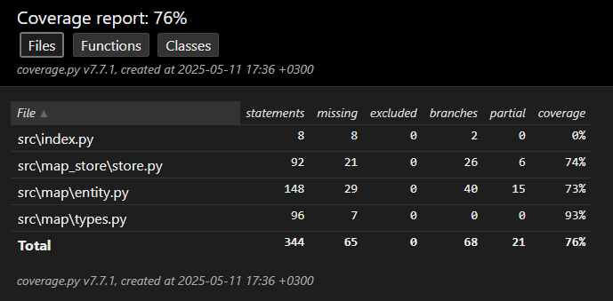

# Testausdokumentti
Sovellusta on testattu automaattisesti yksikkö- ja integraatiotesteillä (unittest) ja manuaalisesti järjestelmätason testeillä (Windows & Linux).

## Yksikkö- ja integraatiotestaus
**Pysyväistallennus ja tiedostojen hallinta**
`MapStore`-luokkaa testataan `TestMapStore`-testiluokalla. Testiluokka alustaa `MapStore`-luokan sellaisenaan satunnaiseen, väliaikaiseen kansioon, jossa käytönnössä testataan pysyväistallennuksen toimivuutta (listaus, luonti ja poistaminen).Lisäksi testataan erikseen tuonti- ja vienti-ominaisuudet.

Testiluokassa on automaattinen `tearDown`-metodi, joka poistaa testeissä käytetyt tiedostot testauksen päätyttyä automaattisesti.

**Sisällön muokkaaminen**
Varsinaisesta sisällön muokaamisesta vastaavaa `Map`-luokkaa testaataan `TestMap`-testiluokalla. Tämäkin testiluokka hyödyntää väliaikaisia tiedostoja levyllä. Testeissä käydään läpi keskeisemmät ominaisuudet, kuten elementtien listaus, luonti ja poistaminen. Lisäksi testataan erikseen `Asset`-olioiden luonti (kuvaavat liitteitä, kuten taustakuvia)

**Testikattavuus**
Ilman käyttöliittymätestejä, sovelluksen testauksen haaraumakattavuus on `76 %`.

Testaamatta jäivät laajalti elementtien muokkaaminen.

## Järjestelmätestaus
Järjestelmätestaus toteutettiin manuaalisesti Windows 10 ja Cubbli Linux -järjestelmillä.

**Asennus ja konfigurointi**
Pythonin ja Poetryn asennuksien poikkeamisen lisäksi sovelluksen asennus ja konfigurointi tapahtuu identtisesti järjestelmästä riippumatta.

Asennuksen ja konfiguroinnin -prosessit on dokumentoitu [käyttöohjeessa](./kayttoohje.md).

**Toiminnallisuudet**
Kaikki [määrittelydokumentin](./vaatimusmaarittely.md) listaamat ominaisuudet on testattu

Lisäksi on testattu spesifisti myös tunnetusti järjestelmäriippuvat osat:
- Tiedostojen vientidialogi
- Tiedostojen tuontidialogi
- Värinvalitadialogi
- Ikkunan skaalaaminen

## Sovellukseen jääneet laadulliset ongelmat
Sovelluksen virhe-ilmoitukset saattavat tietyssä tilanteissa ilmestyä vasta sovelluksen sulkemisen jälkeen komentoriville.
