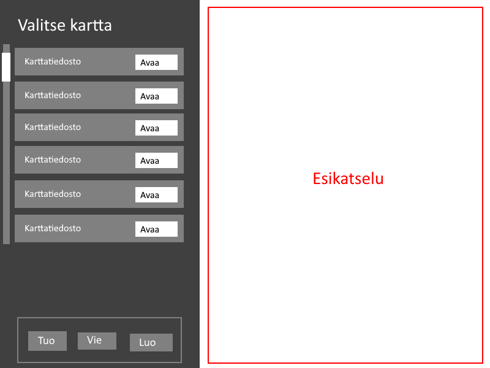
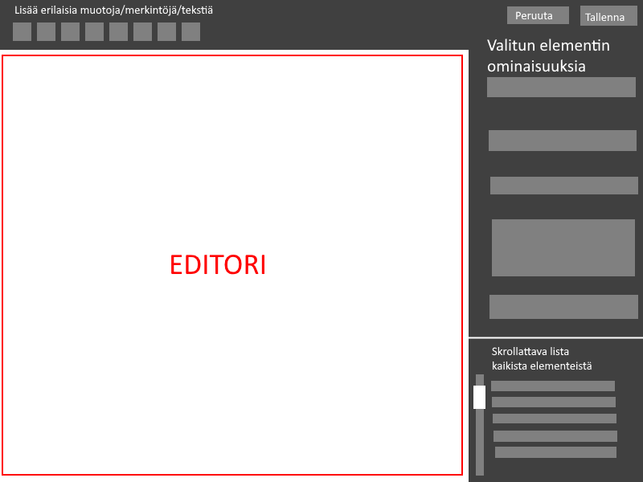

# Vaatimusmäärittely

## Sovelluksen Tarkoitus
Sovelluksen avulla voi luoda, tallentaa ja muokata grid-järjestelmää hyödyntäviä karttoja(tiedostoja) helppoa yksinkertaisen kartan piirtämistä varten RolePlaying-pelien aikana.

## Käyttäjät
Sovelluksessa ei ole erilaisia käyttäjätyyppejä.

## Perusversion Suunnitellut Toiminnallisuudet
- `tehty` Tiedostojen hallinta
    - `tehty` Käyttäjä voi luoda uuden kartan
    - Käyttäjä voi tallentaa kartan valitsemaansa sijaintiin
    - Käyttäjä voi avata kartan valitsemastaan sijainnista
    - `tehty` Käyttäjä voi asettaa kartalle nimen
- Muokkaaminen ja luonti (editori)
    - Käyttäjä voi muokata kartan elementtien väriä ja taustakuvaa
    - `osittain` Käyttäjä voi lisätä kartalle erilaisia muotoja ja viivoja (neliö, pallo, kolmio ja viiva)
    - Käyttäjä voi lisätä karttalle tekstiä
    - `osittain` Käyttäjä voi määrittää muotojen ja merkintöjen sijainnin, koon ja värin
    - Käyttäjä voi poistaa elementtejä, muotoja ja muita merkintöjä
    - Käyttäjä näkee kaikki muodot ja merkinnät listauksesta editorissa ja voi valita ne muokattaviksi listalta
    - Käyttäjä voi peruuttaa tekemänsä muutokset
    - Editorissa on valmiita esimerkkitaustoja kartan elementeille
    
## Käyttöliittymäluonnoksia
Kun sovellus avataan, käyttäjä voi valita aikaisemman, tuoda, viedä tai luoda uuden kartan:

Kartan muokkausnäkymän idea:

## Jatkokehitysiedoita
- Katselunäkymä
    - Käyttäjä voi avata katselunäkymän, jossa näkyy vain kartta ja sen sisältö
    - Katselunäkymän voi avata toiseen ikkunaan ja editorin toiseen
- Käyttäjä voi asettaa kartalle pikkukuvan
- Käyttäjä voi peruuttaa viimeisimmän muokkauksensa
- Automaattinen karttojen varmuuskopiointi virheiden varalta
- Käyttäjä voi valita kartassa olevan tekstin fontin
- Käyttäjä voi tuoda kuvia ja vektoripiirroksia karttoihin
- Ohjelmisto pakkaa kartat tallentaessaan
