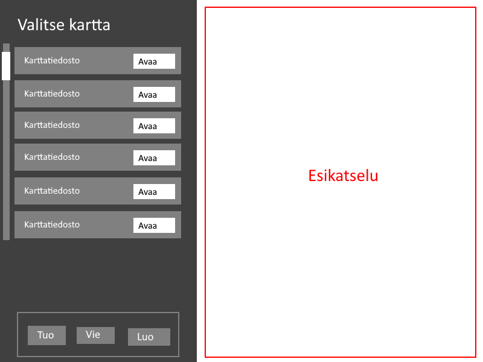
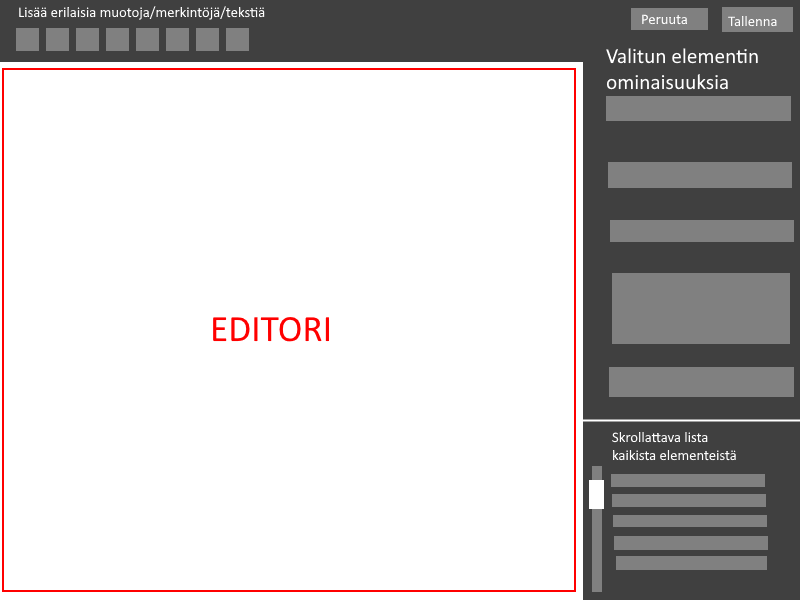

# Vaatimusmäärittely

## Sovelluksen Tarkoitus
Sovelluksen avulla voi luoda, tallentaa ja muokata grid-järjestelmää hyödyntäviä karttoja(tiedostoja) helppoa yksinkertaisen kartan piirtämistä varten RolePlaying-pelien aikana.

## Käyttäjät
Sovelluksessa ei ole erilaisia käyttäjätyyppejä.

## Perusversion tarjoamat ominaisuudet
- Tiedostojen hallinta
    - Käyttäjä voi luoda uuden kartan ja asettaa sille nimen
    - Käyttäjä voi poistaa kartan
    - Käyttäjä voi nimetä uudelleen kartan
    - Käyttäjä voi viedä kartan valitsemaansa sijaintiin
    - Käyttäjä voi tuoda kartan valitsemastaan sijainnista
- Muokkaaminen ja luonti (editori)
    - Käyttäjä voi muokata kartan elementtien väriä ja taustakuvaa
    - Käyttäjä voi lisätä kartalle neliöitä ja tekstiä
    - Käyttäjä voi määrittää muotojen ja merkintöjen sijainnin ja koon
    - Käyttäjä voi poistaa muotoja ja muita merkintöjä
    - Editorissa on valmiita esimerkkitaustoja kartan elementeille
    - Käyttäjä voi kopioida ja liittää muotoja editorissa
    
## Käyttöliittymäluonnoksia
Kun sovellus avataan, käyttäjä voi valita aikaisemman, tuoda, viedä tai luoda uuden kartan:

Kartan muokkausnäkymän idea:

## Jatkokehitysiedoita
- Katselunäkymän voi avata toiseen ikkunaan ja editorin toiseen
- Käyttäjä voi asettaa kartalle pikkukuvan
- Automaattinen karttojen varmuuskopiointi virheiden varalta
- Käyttäjä voi valita kartassa olevan tekstin fontin
- Käyttäjä voi tuoda vektoripiirroksia karttoihin
- Ohjelmisto pakkaa kartat tallentaessaan
- Tallenna kartat Google-Drive App-kansioon
- Kartalle voi lisätä pelinappuloita
- Undo/redo -ominaisuus editoriin
- Group select -ominaisuus editoriin
- Objektilistaus
