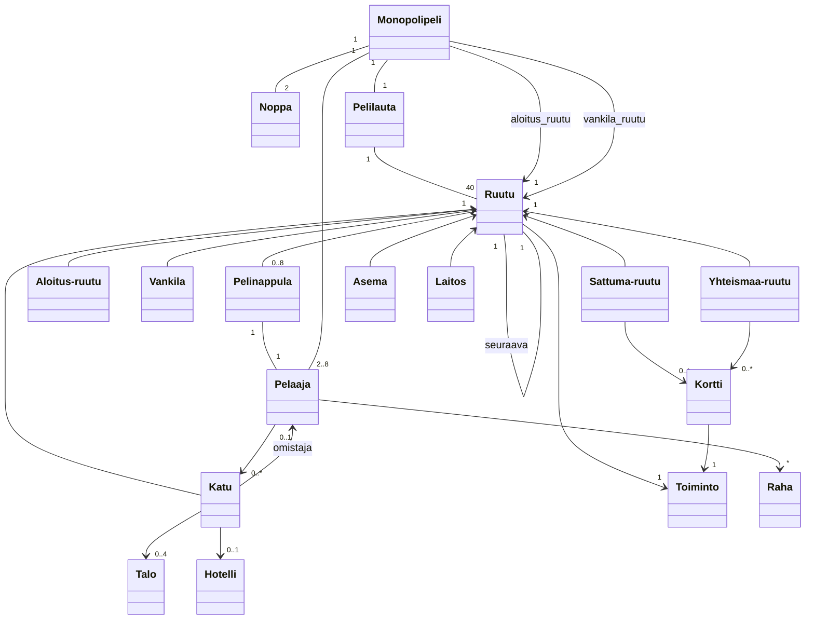

## Monopoli, luokkakaavio

```mermaid
classDiagram
    %% Basics
    Monopolipeli "1" -- "2" Noppa
    Monopolipeli "1" -- "1" Pelilauta
    Pelilauta "1" -- "40" Ruutu
    Ruutu "1" -- "1" Ruutu : seuraava
    Ruutu "1" -- "0..8" Pelinappula

    %% Slot types
    Ruutu <-- Aloitus-ruutu
    Ruutu <-- Vankila
    Ruutu <-- Sattuma-ruutu
    Ruutu <-- Yhteismaa-ruutu
    Ruutu <-- Asema
    Ruutu <-- Laitos
    Ruutu <-- Katu

    %% Game knows start and jail
    Monopolipeli --> "1" Ruutu : aloitus_ruutu
    Monopolipeli --> "1" Ruutu : vankila_ruutu

    %% Actions
    Ruutu --> "1" Toiminto
    Sattuma-ruutu --> "0..*" Kortti
    Yhteismaa-ruutu --> "0..*" Kortti
    Kortti --> "1" Toiminto

    %% Players
    Pelinappula "1" -- "1" Pelaaja
    Pelaaja "2..8" -- "1" Monopolipeli
    Pelaaja --> "*" Raha

    %% Streets, houses and hotels
    Pelaaja --> "0..*" Katu
    Katu --> "0..4" Talo
    Katu --> "0..1" Hotelli
    Katu --> "0..1" Pelaaja : omistaja
```