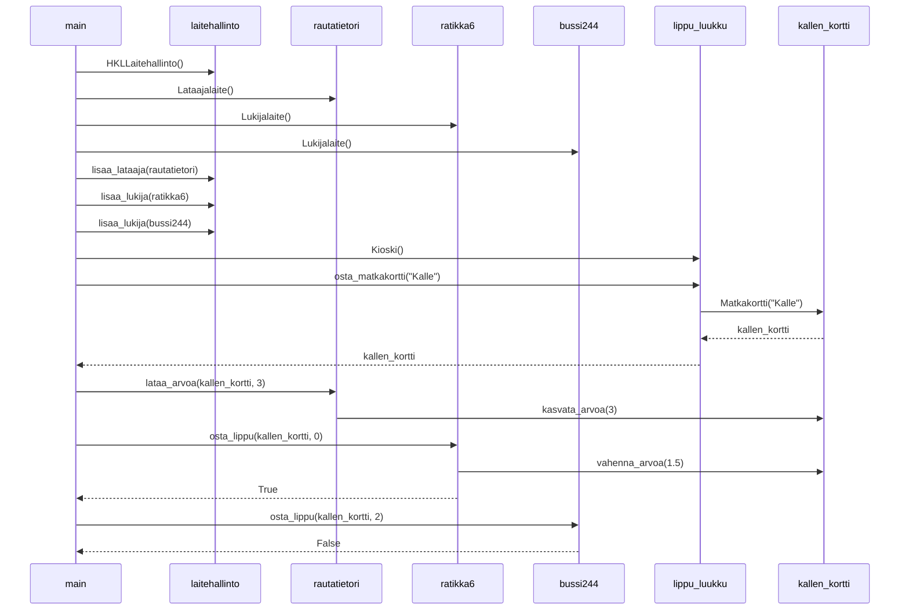

## Sekvenssikaavio

```mermaid
sequenceDiagram
    %% Add columns
    participant main
    participant laitehallinto
    participant rautatietori
    participant ratikka6
    participant bussi244
    participant lippu_luukku
    participant kallen_kortti

    %% Init classes
    main->>laitehallinto: HKLLaitehallinto()
    main->>rautatietori: Lataajalaite()
    main->>ratikka6: Lukijalaite()
    main->>bussi244: Lukijalaite()

    %% Add to laitehallinto
    main->>laitehallinto: lisaa_lataaja(rautatietori)
    main->>laitehallinto: lisaa_lukija(ratikka6)
    main->>laitehallinto: lisaa_lukija(bussi244)

    %% Init classes again
    main->>lippu_luukku: Kioski()
    
    %% Buy kalle card
    main->>lippu_luukku: osta_matkakortti("Kalle")
    lippu_luukku->>kallen_kortti: Matkakortti("Kalle")
    kallen_kortti-->>lippu_luukku: kallen_kortti
    lippu_luukku-->>main: kallen_kortti

    %% Add money to kalle card
    main->>rautatietori: lataa_arvoa(kallen_kortti, 3)
    rautatietori->>kallen_kortti: kasvata_arvoa(3)

    %% Buy tickets
    main->>ratikka6: osta_lippu(kallen_kortti, 0)
    ratikka6->>kallen_kortti: vahenna_arvoa(1.5)
    ratikka6-->>main: True

    main->>bussi244: osta_lippu(kallen_kortti, 2)
    bussi244-->>main: False

```
